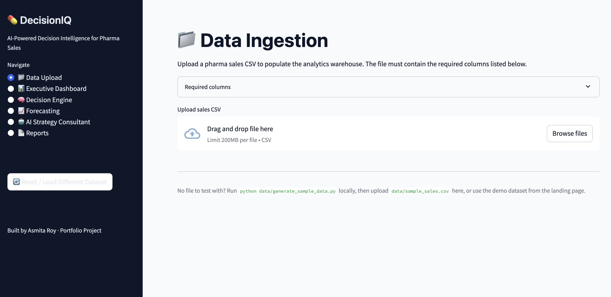
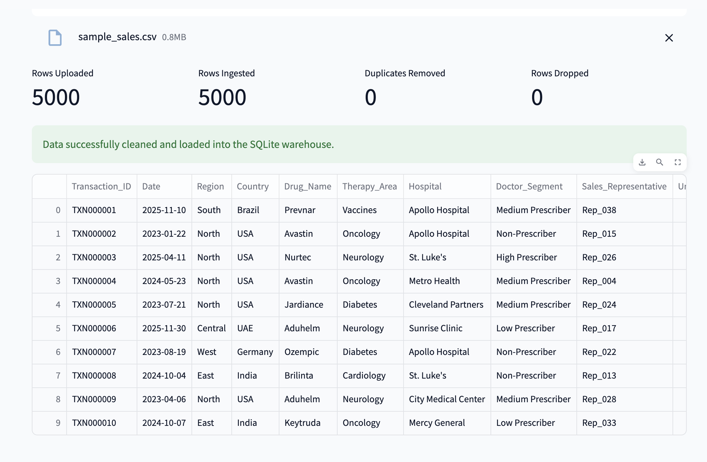
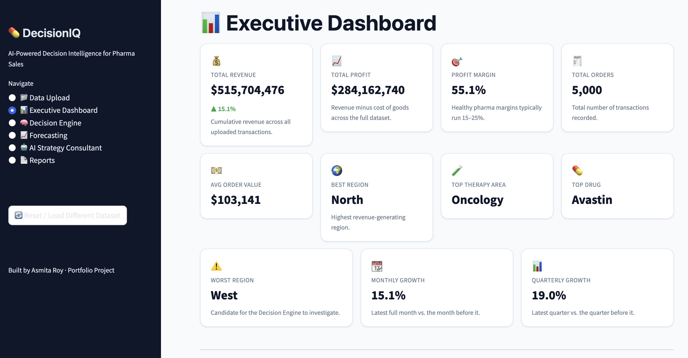
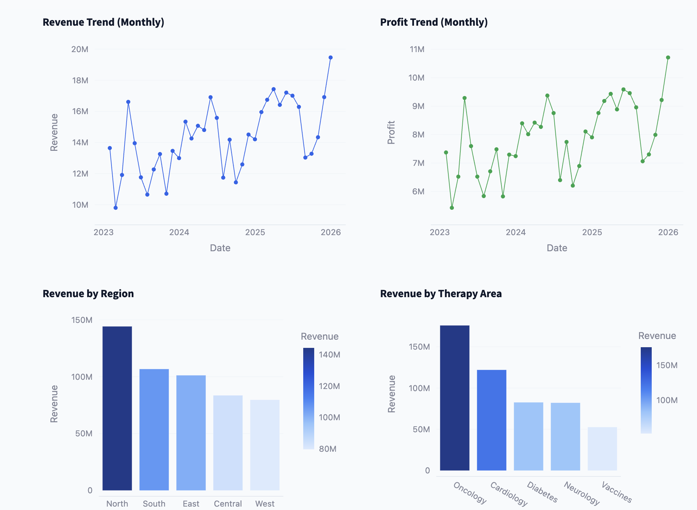
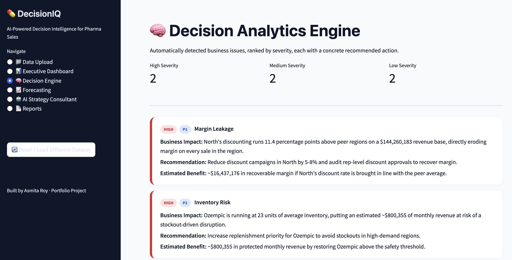
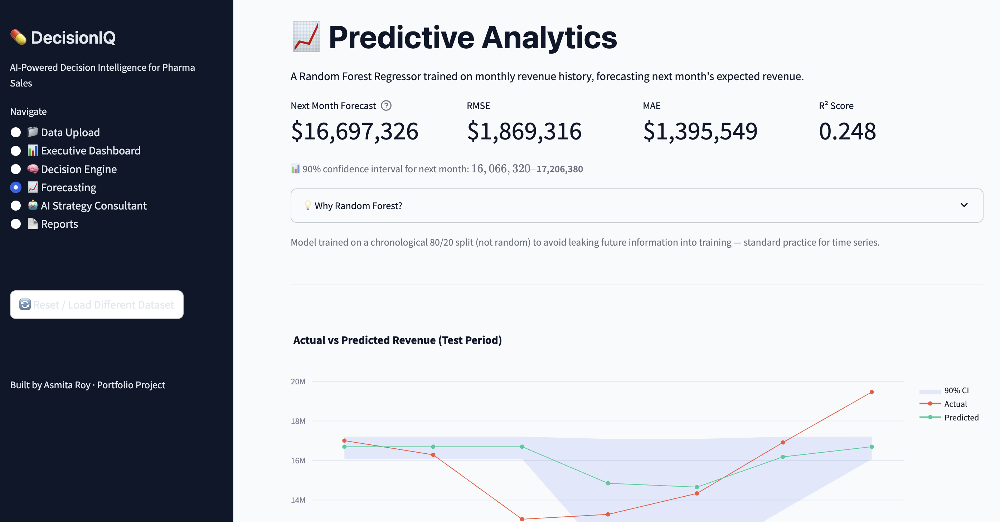
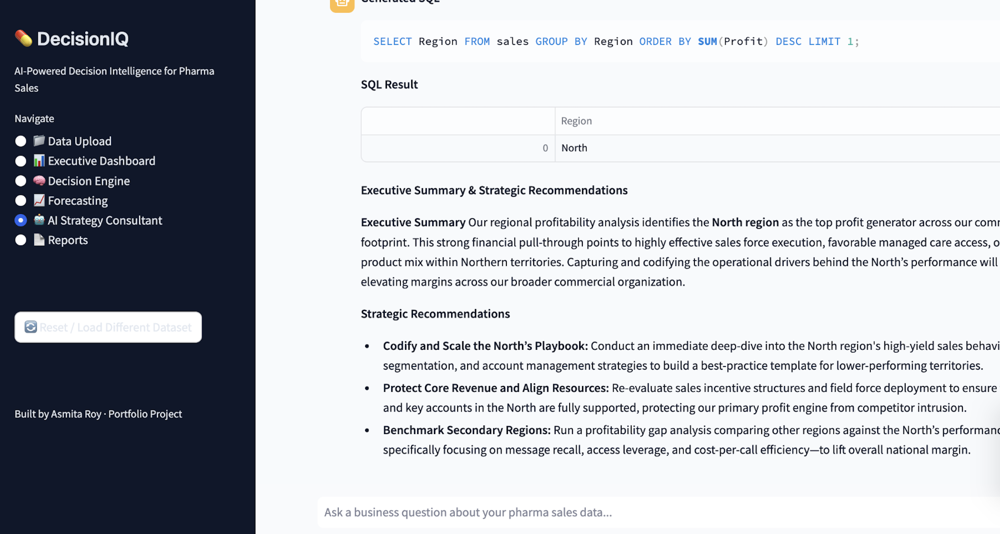

# 💊 DecisionIQ

<p align="center">
  <h3 align="center">AI-Powered Decision Intelligence Platform for Pharmaceutical Sales Analytics</h3>
  <p align="center">
    Transform raw pharmaceutical sales data into executive-level business intelligence using AI, forecasting, and interactive analytics.
  </p>
</p>

---

## 📌 Overview

DecisionIQ is an enterprise-grade business intelligence platform built for pharmaceutical sales analytics. It enables organizations to upload sales data, monitor business performance through interactive dashboards, generate AI-powered insights, forecast future sales trends, and create executive-ready reports.

The platform combines **Business Intelligence**, **Machine Learning**, and **Generative AI** to simulate the workflow of modern analytics solutions used by consulting firms and enterprise organizations.

---

# ✨ Key Features

### 📂 Data Management
- Upload custom pharmaceutical sales datasets
- Built-in demo dataset for instant exploration
- SQLite-powered analytics warehouse

### 📊 Executive Dashboard
- Revenue, Profit and Sales KPIs
- Interactive business visualizations
- Regional and product performance analysis
- Therapy area analytics

### 🧠 AI Strategy Consultant
- Natural Language → SQL conversion using Google Gemini
- Automatic SQL execution
- Executive business summaries
- AI-generated strategic recommendations

### 📈 Sales Forecasting
- Machine Learning based revenue prediction
- Historical trend analysis
- Forecast visualization

### 🎯 Decision Analytics Engine
- Business performance evaluation
- Opportunity identification
- Risk assessment
- Strategic recommendations

### 📄 Executive Reporting
- Professional PDF report generation
- Executive summaries
- Downloadable reports

---

# 📸 Application Preview

## 🏠 Landing Page



---

## 📂 Dataset Upload



---

## 📊 Executive Dashboard



---

## 📈 KPI Overview



---

## 🎯 Decision Analytics Engine



---

## 📈 Sales Forecasting



---

## 🤖 AI Strategy Consultant



---

# 🏗️ System Architecture

```text
                    User
                      │
                      ▼
          Upload Sales Dataset
                      │
                      ▼
             SQLite Data Warehouse
                      │
      ┌───────────────┼────────────────┐
      │               │                │
      ▼               ▼                ▼
 Executive Dashboard Forecasting Decision Engine
      │               │                │
      └───────────────┼────────────────┘
                      ▼
          AI Strategy Consultant
       (Google Gemini Text-to-SQL)
                      │
                      ▼
       Executive Business Insights
                      │
                      ▼
          PDF Report Generation
```

---

# 🚀 Technology Stack

| Category | Technologies |
|----------|--------------|
| **Frontend** | Streamlit |
| **Programming Language** | Python |
| **Database** | SQLite |
| **AI** | Google Gemini API |
| **Data Processing** | Pandas, NumPy |
| **Machine Learning** | Scikit-learn |
| **Visualization** | Plotly, Matplotlib |
| **PDF Reports** | ReportLab |
| **Configuration** | Python Dotenv |

---

# 📂 Project Structure

```text
DecisionIQ
│
├── .streamlit/
├── assets/
├── data/
├── modules/
├── screenshots/
│   ├── 01_landing_page.png
│   ├── 02_data_upload.png
│   ├── 03_executive_dashboard.png
│   ├── 04_kpi_cards.png
│   ├── 05_decision_engine.png
│   ├── 06_forecasting.png
│   └── 07_ai_strategy_consultant.png
│
├── app.py
├── requirements.txt
└── README.md
```

---

# 🤖 AI Workflow

```text
Business Question
        │
        ▼
Google Gemini API
        │
        ▼
Text-to-SQL Generation
        │
        ▼
SQLite Query Execution
        │
        ▼
Business Results
        │
        ▼
Executive Summary
        │
        ▼
Strategic Recommendations
```

---

# ⚙️ Installation

### Clone the Repository

```bash
git clone https://github.com/techAsmita/DecisionIQ.git
```

Move into the project directory

```bash
cd DecisionIQ
```

Install the required dependencies

```bash
pip install -r requirements.txt
```

Create a `.env` file

```env
GEMINI_API_KEY=YOUR_GEMINI_API_KEY
```

Run the application

```bash
streamlit run app.py
```

---

# 📄 Executive Report

DecisionIQ automatically generates downloadable executive PDF reports containing:

- Executive Summary
- Business Insights
- Strategic Recommendations
- Performance Metrics

These reports are designed for management presentations and executive decision-making.

---

# 🌟 Future Enhancements

- User Authentication
- Multi-user Support
- Cloud Database Integration
- Interactive AI Chat Memory
- Automated Email Reports
- Advanced Time-Series Forecasting
- Real-Time Sales Monitoring
- Role-Based Access Control (RBAC)
- Dashboard Export to PowerPoint
- API Integration with CRM Platforms

---

# 🎯 Use Cases

- Pharmaceutical Sales Analytics
- Business Intelligence
- Executive Reporting
- Revenue Forecasting
- AI-Assisted Decision Making
- Commercial Analytics
- Sales Performance Monitoring

---

# 👩‍💻 Author

## Asmita Roy

**Computer Engineering Student**  
Thapar Institute of Engineering & Technology (2023–2027)

🔗 **Portfolio:** https://techasmita.github.io/Portfolio-Website/  
💼 **LinkedIn:** https://www.linkedin.com/in/techasmita/  
💻 **GitHub:** https://github.com/techAsmita

---

## ⭐ Support

If you found this project useful, consider giving it a **Star ⭐** on GitHub.

---

> **DecisionIQ demonstrates the integration of Business Intelligence, Machine Learning, and Generative AI to transform structured sales data into actionable executive insights.**